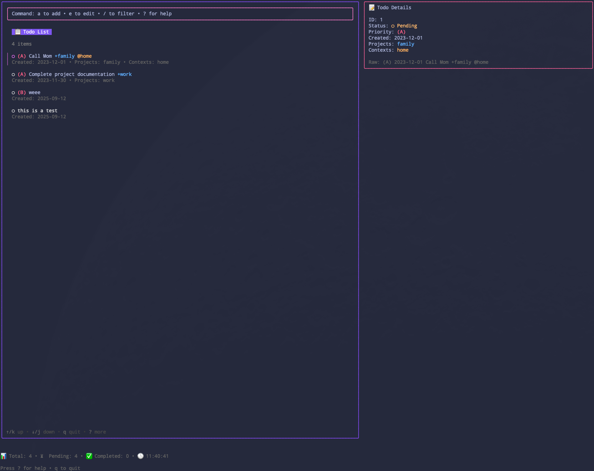

```
██╗      █████╗ ███████╗██╗   ██╗████████╗ ██████╗ ██████╗  ██████╗
██║     ██╔══██╗╚══███╔╝╚██╗ ██╔╝╚══██╔══╝██╔═══██╗██╔══██╗██╔═══██╗
██║     ███████║  ███╔╝  ╚████╔╝    ██║   ██║   ██║██║  ██║██║   ██║
██║     ██╔══██║ ███╔╝    ╚██╔╝     ██║   ██║   ██║██║  ██║██║   ██║
███████╗██║  ██║███████╗   ██║      ██║   ╚██████╔╝██████╔╝╚██████╔╝
╚══════╝╚═╝  ╚═╝╚══════╝   ╚═╝      ╚═╝    ╚═════╝ ╚═════╝  ╚═════╝
```

<div align="center">

## 🌆 **NEON TODO TERMINAL** 🌆

### _A cyberpunk TUI wrapper for todo.txt with electric vibes_

[]()
[]()
[]()

</div>

---

**Experience todo management in full synthwave glory.** This isn't just another terminal app – it's a portal to productivity with that electric 80's aesthetic. Built with Charm's Bubble Tea framework for buttery-smooth rendering and neon-bright colors.

> _"In the grid of productivity, every task glows with purpose."_

```
▲▼▲▼▲▼▲▼▲▼▲▼▲▼▲▼▲▼▲▼▲▼▲▼▲▼▲▼▲▼▲▼▲▼▲▼▲▼▲▼▲▼▲▼▲▼▲▼▲▼▲▼▲▼▲▼▲▼▲▼▲▼▲▼
█████████████████ ⚡ ELECTRIC FEATURES ⚡ █████████████████
▲▼▲▼▲▼▲▼▲▼▲▼▲▼▲▼▲▼▲▼▲▼▲▼▲▼▲▼▲▼▲▼▲▼▲▼▲▼▲▼▲▼▲▼▲▼▲▼▲▼▲▼▲▼▲▼▲▼▲▼▲▼▲▼
```

🎛️ **CHROME INTERFACE** - Powered by Charm's Bubble Tea framework for glass-smooth, flicker-free rendering that glows like neon

💾 **RETRO COMPATIBILITY** - Full todo.txt format support - works with your existing workflow like a vintage synthesizer

⚡ **LIGHTNING NAVIGATION** - Vim-inspired keybindings for maximum efficiency in the digital grid

🔮 **REAL-TIME MATRIX** - Instant add/edit/delete operations with live updates that pulse through your system

🌈 **PRIORITY SPECTRUM** - Full (A), (B), (C) priority support with color-coded neon highlighting

🏷️ **TAGGED REALITY** - @context and +project tag support for organizing your digital life

🔍 **LASER FILTERING** - Real-time search and filtering that cuts through data like light through darkness

📱 **ADAPTIVE DISPLAY** - Multiple view modes that automatically adjust to your terminal dimensions

✨ **MINIMAL NEON** - Clean, distraction-free interface that glows with purpose

#TODO: Screenshot 1 - Main Interface



<div align="center">
<em>👆 The main interface - where productivity meets cyberpunk aesthetics</em>
</div>

```
★★★★★★★★★★★★★★★★★★★★★★★★★★★★★★★★★★★★★★★★★★★★★★★★★★★★★★★★★★
♥♥♥♥♥♥♥♥♥♥ 🔌 SYSTEM REQUIREMENTS - JACK IN 🔌 ♥♥♥♥♥♥♥♥♥♥
★★★★★★★★★★★★★★★★★★★★★★★★★★★★★★★★★★★★★★★★★★★★★★★★★★★★★★★★★★
```

**Before entering the neon grid**, ensure your system has the core todo.txt framework:

### 🍎 **macOS**

```bash
# Install todo.txt-cli
brew install todo-txt
```

### 🐧 **Linux (Ubuntu/Debian)**

```bash
# Install todo.txt-cli
sudo apt-get install todotxt-cli
```

### 🌍 **Other Systems**

See installation instructions: [todo.txt-cli GitHub Repository](https://github.com/todotxt/todo.txt-cli)

### ⚙️ **Configuration**

Once installed, todo.txt-cli will create default files:

```
💾 Default todo file: ~/todo.txt
🗄 Done file: ~/done.txt
⚙️ Configuration: ~/.todo/config
```

**Customize file locations** by editing `~/.todo/config`. lazytodo will automatically read this configuration to locate your todo files.

**Example ~/.todo/config:**

```bash
# Todo.txt-cli configuration
export TODO_DIR="$HOME/Documents/todos"
export TODO_FILE="$TODO_DIR/todo.txt"
export DONE_FILE="$TODO_DIR/done.txt"
export REPORT_FILE="$TODO_DIR/report.txt"
```

```
◆◇◆◇◆◇◆◇◆◇◆◇◆◇◆◇◆◇◆◇◆◇◆◇◆◇◆◇◆◇◆◇◆◇◆◇◆◇◆◇◆◇◆◇◆◇◆◇◆◇◆◇◆◇
📟📟📟📟📟📟📟📟 🚀 INSTALL SEQUENCE - ENTER THE GRID 🚀 📟📟📟📟📟📟📟📟
◆◇◆◇◆◇◆◇◆◇◆◇◆◇◆◇◆◇◆◇◆◇◆◇◆◇◆◇◆◇◆◇◆◇◆◇◆◇◆◇◆◇◆◇◆◇◆◇◆◇◆◇◆◇◆◇
```

### 🎆 **Quick Install (Recommended)**

**One-liner installation:**
```bash
# Download and install latest release
curl -sSL https://raw.githubusercontent.com/zachreborn/lazytodo/main/install.sh | bash
```

### 🍎 **macOS (Homebrew)**

```bash
# Coming soon - Homebrew tap
# brew install zachreborn/tap/lazytodo

# For now, use the install script or build from source
```

### 📦 **Download Pre-built Binaries**

Download from [GitHub Releases](https://github.com/zachreborn/lazytodo/releases):

```bash
# macOS (Intel)
curl -L -o lazytodo https://github.com/zachreborn/lazytodo/releases/latest/download/lazytodo-darwin-amd64
chmod +x lazytodo
sudo mv lazytodo /usr/local/bin/

# macOS (Apple Silicon)
curl -L -o lazytodo https://github.com/zachreborn/lazytodo/releases/latest/download/lazytodo-darwin-arm64
chmod +x lazytodo
sudo mv lazytodo /usr/local/bin/

# Linux (x86_64)
curl -L -o lazytodo https://github.com/zachreborn/lazytodo/releases/latest/download/lazytodo-linux-amd64
chmod +x lazytodo
sudo mv lazytodo /usr/local/bin/
```

### 🔭 **Build from Source**

```bash
# Clone the repository
git clone https://github.com/zachreborn/lazytodo.git
cd lazytodo

# Option 1: Use Makefile (recommended)
make install

# Option 2: Manual build and install
go build -o lazytodo
./install.sh

# Option 3: Just build (binary stays in current directory)
go build -o lazytodo
```

### ⚡ **Usage**

Once installed, run from anywhere:
```bash
# Start the neon TUI
lazytodo

# Show version
lazytodo --version

# Show help
lazytodo --help
```

**First run:**
```
$ lazytodo
[Electric TUI launches with your todo list]
```

### 🗑️ **Uninstall**

To remove lazytodo from your system:

```bash
# Using the uninstall script
curl -sSL https://raw.githubusercontent.com/zachreborn/lazytodo/main/uninstall.sh | bash

# Or if you have the repository
./uninstall.sh

# Manual removal
sudo rm -f /usr/local/bin/lazytodo
# or
rm -f ~/.local/bin/lazytodo

# Using Makefile
make uninstall
```

*Note: Your todo.txt files and configuration remain untouched.*
```

```
⚫⬤⚫⬤⚫⬤⚫⬤⚫⬤⚫⬤⚫⬤⚫⬤⚫⬤⚫⬤⚫⬤⚫⬤⚫⬤⚫⬤⚫⬤⚫⬤⚫⬤⚫⬤⚫⬤⚫⬤⚫⬤⚫⬤⚫⬤⚫⬤
🏢🏢🏢🏢🏢 🕹️ NEURAL INTERFACE PROTOCOLS 🕹️ 🏢🏢🏢🏢🏢
⚫⬤⚫⬤⚫⬤⚫⬤⚫⬤⚫⬤⚫⬤⚫⬤⚫⬤⚫⬤⚫⬤⚫⬤⚫⬤⚫⬤⚫⬤⚫⬤⚫⬤⚫⬤⚫⬤⚫⬤⚫⬤⚫⬤⚫⬤⚫⬤
```

### 🔌 **Command Line Options**

```bash
lazytodo                 # Start the TUI
lazytodo --help          # Show help
lazytodo --version       # Show version
```

**Help output:**

```
$ ./lazytodo --help
lazytodo - A TUI wrapper for todo.txt (Charm Edition)

Usage:
  lazytodo                 Start the TUI
  lazytodo --version       Show version
  lazytodo --help          Show this help

Key bindings (once in TUI):
Navigation:
  j/↓        Move down
  k/↑        Move up
  g/Home     Go to top
  G/End      Go to bottom

Todo actions:
  a          Add new todo
  e          Edit todo
  d          Delete todo
  x/Space    Toggle todo completion

Priority:
  1          Set priority A (highest)
  2          Set priority B
  3          Set priority C

Other:
  r          Refresh from file
  /          Filter/search todos
  ?          Show/hide help
  q/Ctrl+C   Quit

Input mode keys:
  Enter      Submit input
  Esc        Cancel input

🎭 Powered by Charm - https://charm.sh
```

### ⚙️ **Keybindings**

#### 🕺 **Navigation**

- `j` or `↓` - Move cursor down
- `k` or `↑` - Move cursor up
- `g` or `Home` - Go to first todo
- `G` or `End` - Go to last todo

#### ⚡ **Todo Actions**

- `a` - Add new todo (uses command window)
- `x` or `Space` - Toggle todo completion
- `d` - Delete selected todo
- `e` - Edit selected todo (uses command window)

#### 🔍 **Filtering and Search**

- `/` - Filter todos (uses command window)
- `p` - Filter by project
- `c` - Filter by context

#### 🌈 **Priority Setting**

- `1` - Set priority (A)
- `2` - Set priority (B)
- `3` - Set priority (C)
- `0` - Remove priority

#### 📱 **View Options**

- `v` - Cycle through view modes
- `?` - Show/hide help screen
- `r` - Refresh (reload from todo.txt file)
- `q` or `Ctrl+C` - Quit

#### 🕹️ **Command Window Input**

_When using the command window (add/edit/filter):_

- `Enter` - Confirm action or apply filter
- `Escape` - Cancel and return to list
- `Backspace` - Delete character
- Standard text input and cursor movement

```
◈◉◈◉◈◉◈◉◈◉◈◉◈◉◈◉◈◉◈◉◈◉◈◉◈◉◈◉◈◉◈◉◈◉◈◉◈◉◈◉◈◉◈◉◈◉◈◉
👾👾👾👾👾👾 💾 DATA FORMAT PROTOCOLS 💾 👾👾👾👾👾👾
◈◉◈◉◈◉◈◉◈◉◈◉◈◉◈◉◈◉◈◉◈◉◈◉◈◉◈◉◈◉◈◉◈◉◈◉◈◉◈◉◈◉◈◉◈◉◈◉
```

**lazytodo** processes data using the classic **todo.txt format** - a retro specification that's as clean as chrome:

```bash
(A) 2025-09-15 🚀 Launch rocket to Mars +space @launchpad
2025-09-15 🌸 Buy neon flowers +shopping @cybermall
x 2025-09-14 ✨ Complete synthwave playlist +music
(B) 2025-09-16 💻 Code in electric dreams +work @terminal
```

### 🏷️ **Format Elements**

- `x` - Marks completed todos
- `(A)`, `(B)`, `(C)` - Priority levels (A = highest)
- `2025-09-15` - Creation date (YYYY-MM-DD)
- `+project` - Project tags
- `@context` - Context tags

### 📁 **File Locations**

**lazytodo** automatically reads your todo.txt configuration from `~/.todo/config`:

**Default Locations:**

```
💾 Todo file: ~/todo.txt
🗄 Done file: ~/done.txt
⚙️ Configuration: ~/.todo/config
```

**Custom Configuration:**

```bash
export TODO_DIR="/path/to/your/todo/directory"
export TODO_FILE="$TODO_DIR/todo.txt"
export DONE_FILE="$TODO_DIR/done.txt"
```

_If no configuration file exists, lazytodo will use the default locations._

**File structure example:**

```
$ ls -la ~/
-rw-r--r-- 1 user staff  256 Sep 15 10:30 todo.txt
-rw-r--r-- 1 user staff  128 Sep 15 10:30 done.txt
drwxr-xr-x 3 user staff   96 Sep 15 10:30 .todo/

$ cat ~/.todo/config
export TODO_DIR="$HOME"
export TODO_FILE="$TODO_DIR/todo.txt"
export DONE_FILE="$TODO_DIR/done.txt"
```

```
▪▫▪▫▪▫▪▫▪▫▪▫▪▫▪▫▪▫▪▫▪▫▪▫▪▫▪▫▪▫▪▫▪▫▪▫▪▫▪▫▪▫▪▫▪▫▪▫
🌌🌌🌌🌌🌌🌌 ⚡ ADVANCED NEURAL FEATURES ⚡ 🌌🌌🌌🌌🌌🌌
▪▫▪▫▪▫▪▫▪▫▪▫▪▫▪▫▪▫▪▫▪▫▪▫▪▫▪▫▪▫▪▫▪▫▪▫▪▫▪▫▪▫▪▫▪▫▪▫
```

### 🌀 **Sorting**

Todos are automatically sorted by:

1. Completion status (incomplete first)
2. Priority (A > B > C > no priority)
3. ID/creation order

### ⏰ **Auto-dating**

New todos automatically get the current date as their creation date.

### ⚡ **Real-time Updates**

Changes are immediately saved to your todo.txt file, so you can use lazytodo alongside other todo.txt tools.

**Live sync example:**

```bash
# Changes in lazytodo are immediately saved
$ echo "(A) 2025-09-15 New urgent task" >> ~/todo.txt
# Refresh lazytodo with 'r' to see the new task

# Or edit in lazytodo and check the file
$ tail ~/todo.txt
2025-09-15 Buy groceries +shopping @store
2025-09-15 Call dentist +health @phone
```

```
▅▆▇█▉▊▋▌▍▎▏▐░▒▓▔▕▖▗▘▙▚▛▜▝▞▟■□▢▣▤▥▦▧▨▩▪▫▬▭▮▯
🌆🌆🌆 🤝 JOIN THE NEON RESISTANCE 🤝 🌆🌆🌆
▅▆▇█▉▊▋▌▍▎▏▐░▒▓▔▕▖▗▘▙▚▛▜▝▞▟■□▢▣▤▥▦▧▨▩▪▫▬▭▮▯
```

**Contributions welcome!** Here's how to contribute:

1. 🍴 Fork the repository
2. 🌱 Create a feature branch
3. ⚡ Make your changes
4. 🧪 Test thoroughly
5. 🚀 Submit a pull request

```
▰▱▲△▴▵▶▷▸▹►▻▼▽▾▿◀◁◂◃◄◅◆◇◈◉◊○◌◍◎●◐◑◒◓◔◕◖◗◘◙
📜📜📜📜📜📜 🔓 DIGITAL LICENSE MATRIX 🔓 📜📜📜📜📜📜
▰▱▲△▴▵▶▷▸▹►▻▼▽▾▿◀◁◂◃◄◅◆◇◈◉◊○◌◍◎●◐◑◒◓◔◕◖◗◘◙
```

**MIT License** - See LICENSE file for details.

```
┃┏┓┗┛┣┫┳┻╇╋┃┏┓┗┛┣┫┳┻╇╋┃┏┓┗┛┣┫┳┻╇╋┃┏┓┗┛┣┫┳┻╇╋
♥♥♥♥♥♥ 🎆 WHY CHOOSE THE NEON PATH? 🎆 ♥♥♥♥♥♥
┃┏┓┗┛┣┫┳┻╇╋┃┏┓┗┛┣┫┳┻╇╋┃┏┓┗┛┣┫┳┻╇╋┃┏┓┗┛┣┫┳┻╇╋
```

⚡ **Fast** - Minimal overhead, instant startup

🧠 **Simple** - No complex configuration or learning curve

🌐 **Compatible** - Works with existing todo.txt workflows

🎯 **Focused** - Does one thing well - managing todos

🚀 **Portable** - Single binary, no dependencies

**Performance:**

```
$ time ./lazytodo --version
lazytodo version 1.0.0

real    0m0.003s
user    0m0.001s
sys     0m0.001s

# Binary size
$ ls -lh lazytodo
-rwxr-xr-x 1 user staff 4.8M Sep 15 10:22 lazytodo
```

```
⭐✨⭐✨⭐✨⭐✨⭐✨⭐✨⭐✨⭐✨⭐✨⭐✨⭐✨⭐✨⭐✨⭐✨⭐✨⭐✨⭐✨⭐✨⭐✨⭐✨⭐✨
🏆🏆🏆 🌌 EXPLORE THE DIGITAL COSMOS 🌌 🏆🏆🏆
⭐✨⭐✨⭐✨⭐✨⭐✨⭐✨⭐✨⭐✨⭐✨⭐✨⭐✨⭐✨⭐✨⭐✨⭐✨⭐✨⭐✨⭐✨⭐✨⭐✨⭐✨
```

**Similar Projects:**

💻 [**todo.txt-cli**](https://github.com/todotxt/todo.txt-cli) - Command-line tool for todo.txt

🎆 [**lazygit**](https://github.com/jesseduffield/lazygit) - TUI for git (inspiration for this project)

---

<div align="center">

```
▄▄ █▄▄▄█ ▄▄▄▄ ▄▄▄ ▄▄▄▄
▄▄▄ █   █ █  █ █  █  █
███ █▀▀▀█ █  █ █  █  █
███ █   █ ▀▀▀▀ ▀▀▀ ▀▀▀▀
```

### **Made with 💖 Electric Love 💖 and ⚡ Go Lightning ⚡**

_In the neon-lit terminals of tomorrow, productivity glows eternal_

🎆 **Welcome to the future of todo management** 🎆

</div>
